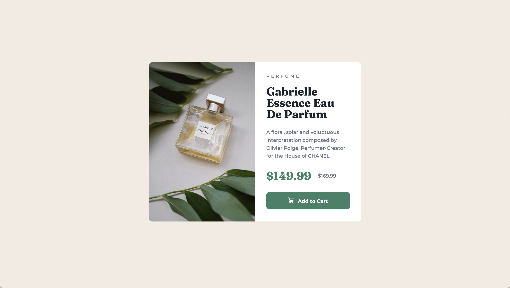

# Frontend Mentor - Product preview card component solution

This is a solution to the [Product preview card component challenge on Frontend Mentor](https://www.frontendmentor.io/challenges/product-preview-card-component-GO7UmttRfa). Frontend Mentor challenges help you improve your coding skills by building realistic projects.

## Table of contents

- [Overview](#overview)
  - [The challenge](#the-challenge)
  - [Screenshot](#screenshot)
  - [Links](#links)
- [My process](#my-process)
  - [Built with](#built-with)
  - [What I learned](#what-i-learned)
- [Author](#author)

**Note: Delete this note and update the table of contents based on what sections you keep.**

## Overview

### The challenge

Users should be able to:

- View the optimal layout depending on their device's screen size
- See hover and focus states for interactive elements

### Screenshot

### Links

- Solution URL: [View Code](https://github.com/ldg/product-preview-card-component-main)
- Live Site URL: [View Solution](https://ldg.github.io/product-preview-card-component-main/)

## My process

After reviewing the project files, I first setup my Sass folders, then I built out the basic HTML markup. Following BEM naming conventions I added classes to all the elements. I added any additional markup where needed as I built the product card

### Built with

- Semantic HTML5 markup
- CSS custom properties
- Flexbox
- CSS Grid
- Mobile-first workflow
- [Sass](https://sass-lang.com/) - For styles

**Note: These are just examples. Delete this note and replace the list above with your own choices**

### What I learned

I used this project to continue practicing using Sass.

## Author

- Frontend Mentor - [@yourusername](https://www.frontendmentor.io/profile/ldg)
